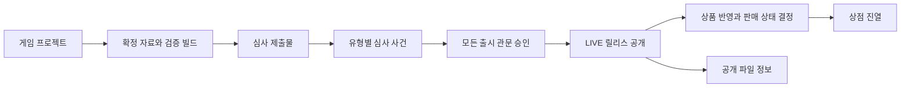
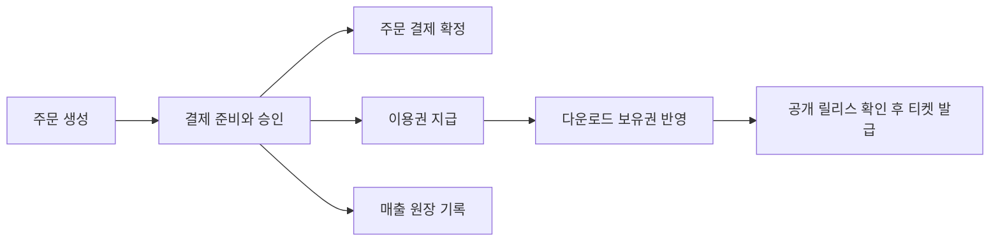

# 대표 업무 흐름

[용어집](../domain-glossary.md) · [창작·심사·출시 정의](publishing.md) · [구매·이용·정산 정의](commerce.md) · [미결 질문](open-questions.md)

아래는 현재 코드에 근거한 대표 시나리오다. 정책 합의 여부는 각 정의에서 별도로 확인한다. API 요청 예제는 [README](../../README.md#5-전-구간-시나리오), 세부 계약은 [서비스 명세](../services.md)와 각 앱의 OpenAPI 스냅샷을 사용한다.

## 창작자: 준비한 내용을 심사받아 공개한다

예시: 창작자 민수는 BASIC 프로젝트 `GAME-A`의 제품 버전 `1.2.0`을 공개하려 한다.

1. 창작자 계정의 워크스페이스에 [게임 프로젝트](publishing.md#game-project)를 등록한다. 프로젝트 ID와 상품 코드를 확보한다. 구매용 상품 ID는 이 시점에 아직 없을 수 있다.
2. 같은 프로젝트에 스크린샷과 커버를 업로드하고, 해당 URL로 [상점 자료](publishing.md#store-page-revision)를 작성·미리보기한 뒤 **확정**한다. 가격 이력과 등급 설문 이력도 준비한다. 자료 이력 순번·ID·게임 버전은 [서로 다른 값](../domain-glossary.md#versions)이다.
3. 프로젝트 범위 업로드 자격으로 [빌드](publishing.md#game-build)를 올리고 `VALIDATED`를 확인한다. 파일 검증 통과는 심사 승인이 아니다.
4. 같은 프로젝트의 확정 자료 ID들과 검증 빌드 묶음을 선택해 [심사 제출물](publishing.md#submission)을 만든다. `SubmissionCreated`가 Review에 전달되면 여섯 유형의 사건이 만들어진다.
5. 심사 결과가 [출시 관문](publishing.md#submission-gate)에 반영되어 모두 승인되면 제출물이 `READY_FOR_RELEASE`가 된다. 수정할 내용이 생기면 새 자료·빌드와 새 제출물을 만들고, 같은 자료의 판단에 이의가 있으면 재검토한다.
6. [릴리스](publishing.md#release)를 즉시 공개하거나 예약한다. 공개 직전 모든 빌드의 상태·저장 객체 크기를 확인한다. DEV·TEST·STAGE 공개는 내부 채널이며 LIVE 공개에서만 구매자 대상 이벤트를 보낸다.
7. Catalog가 LIVE 릴리스를 [상품](publishing.md#product)에 반영한다. 현재 BASIC은 자동 `ON_SALE`이 되고 Store가 진열 사본을 갱신한다. Download도 같은 릴리스의 파일 정보를 반영한다. DEMO·BUNDLE은 일반 판매가 제한된다.

**중단·예외:** 초안 상점 자료, 다른 프로젝트 자료, 검증 중인 빌드로 제출할 수 없다. 한 유형의 승인이 전체 승인으로 대체되지 않는다. smoke test 실패는 `SMOKE_TEST_FAILED`로 남고 공개되지 않는다. Catalog·Store·Download는 비동기로 반영하므로 한 화면의 성공 응답만으로 모든 사본 반영을 확인하지 않는다.

근거: [SubmissionService](../../apps/studio/src/main/java/com/stove/studio/core/service/SubmissionService.java), [ReleaseService](../../apps/studio/src/main/java/com/stove/studio/core/service/ReleaseService.java), [ProductCommandService](../../apps/catalog/src/main/java/com/stove/catalog/core/service/ProductCommandService.java). [TrackACreatorFlowTest](../../e2e/src/test/java/com/stove/e2e/TrackACreatorFlowTest.java)는 이미지·빌드 업로드, 제출·수정 요청·재제출, 전체 승인, LIVE 반영, 정상 롤백과 채널 승격을 검증한다. 잘못된 승인 스냅샷·실패 롤백 등 남은 테스트 공백은 [Q11](open-questions.md#q11)에 기록한다.

## 심사자: 제출된 자료를 유형별로 판단한다

1. [심사 사건](publishing.md#review-case)을 찾아 담당자를 배정하고 체크리스트·내부 메모를 기록한다. 대상은 제출 때 고정한 자료와 빌드다.
2. 등급 사건은 해당 설문·지역·정책 버전에 따른 경로를 확인한다. 현재 자체등급 경로는 ALL/12/15, GRAC 경로는 외부 접수 증빙이 있는 18세 판단을 처리한다. 나머지 유형은 각 심사의 승인 또는 수정 요청을 기록한다.
3. 승인하면 해당 유형의 업무 사실이 Studio에 반영된다. 수정 요청은 사유 코드·외부 피드백으로 창작자에게 보완 사항을 전달한다.
4. 차단·만료·수정 요청 사건의 판단을 다시 검토할 때는 사유를 남겨 사건을 다시 열고 회차를 늘린다. 자료 자체를 바꾸려면 창작자의 새 제출물이 필요하다.

**중단·예외:** 외부 접수 없는 GRAC 승인, 정책 결정과 다른 등급 승인, 이미 승인된 사건의 재승인은 거절된다. 현재 체크리스트 완료·배정자 일치는 승인 필수 조건으로 구현되어 있지 않다. 차단·취소·만료는 Studio 관문에 같은 상태로 전파되지 않는다([Q4](open-questions.md#q4)).

근거: [SubmissionReviewService](../../apps/review/src/main/java/com/stove/review/core/service/SubmissionReviewService.java), [ReviewCaseTest](../../apps/review/src/test/java/com/stove/review/core/domain/ReviewCaseTest.java), [SubmissionReviewServiceTest](../../apps/review/src/test/java/com/stove/review/core/service/SubmissionReviewServiceTest.java).

## 구매자: 주문·결제 후 이용한다

예시: 구매자 지수는 판매 중인 `GAME-A` 한 개를 구매한다.

1. 상품을 조회하고 Catalog의 `productId`로 [주문](commerce.md#order)한다. 서버가 판매 상태와 활성 할인 행사를 확인하고, 결제액·할인 부담·정산 금액 사본을 고정한다. 구매자는 로그인 정보로 정한다.
2. `OrderCreated`가 전달되면 [결제](commerce.md#payment) 대기가 생성된다. 결제를 준비해 PG 사전등록 거래와 금액을 정한다.
3. 인증된 승인 콜백의 거래·금액이 일치하면 정상 결제 완료 사실을 발행한다. 주문은 `PAID`, [이용권](commerce.md#license)은 `ACTIVE`, [정산 원장](commerce.md#settlement-record)은 `SALE`로 각각 반영된다.
4. 라이브러리에서 이용권을 확인한다. `LicenseIssued`가 전달되면 Download의 [보유권 사본](commerce.md#entitlement)이 활성화된다.
5. 상품 코드로 다운로드 티켓을 요청한다. 보유권과 공개 릴리스가 준비되어 있으면 선택한 OS·아키텍처의 파일 URL을 받는다. 출발 버전에 맞는 델타가 없으면 전체 파일로 돌아간다.

**중단·예외:** 기대 금액 불일치나 판매 중지 상품은 주문 단계에서 거절한다. 승인 거절은 `FAILED`로 끝나며 이용권을 지급하지 않는다. 결제 성공 뒤 이용권이나 보유권 반영이 지연될 수 있다. 지급 최종 실패의 보상은 환불 경로를 사용한다. 늦은 승인·취소·환불은 아래에서 따로 확인한다.

근거: [TrackBCommerceFlowTest](../../e2e/src/test/java/com/stove/e2e/TrackBCommerceFlowTest.java), [TrackCFulfillmentFlowTest](../../e2e/src/test/java/com/stove/e2e/TrackCFulfillmentFlowTest.java), [PaymentFailurePathTest](../../e2e/src/test/java/com/stove/e2e/PaymentFailurePathTest.java). 인증 요청 형식은 [P3 문서](../p3-commerce-security.md).

## 구매자·운영자: 환불하고 판매자 월 마감을 확인한다

1. 구매자는 결제 서비스에 환불을 요청한다. `CANCELING`은 환불 진행 중이며 PG 완료 뒤 `CANCELED`가 된다. 사용자 주문 취소와 실제 환불 연결의 차이는 [Q9](open-questions.md#q9)를 확인한다.
2. `PaymentCancelled`를 받아 주문을 취소하고, 이용권을 회수하고, 원매출에 대응하는 환불 원장을 추가한다. `LicenseRevoked`는 보유권 사본에 반영된다. 원장 매출 행은 환불로 삭제하지 않는다.
3. 운영자는 PG 오류로 남은 `CANCELING`의 재시도 결과와 이벤트 반영 상태를 확인한다. 지급 최종 실패 보상도 같은 환불 경로를 사용한다. 결제창 만료 후 승인은 `PaymentCompleted` 없이 자동 환불하므로 정상 매출·지급 흐름과 다르다.
4. 운영자는 판매자·귀속 월별 [월 마감](commerce.md#seller-settlement)을 수행한다. 미마감 원장만 합산하고, 양수 정산액에 계산서 번호가 없으면 별도 발행을 시도한다.
5. 같은 월의 미마감 원장이 나중에 생기면 재마감 시 기존 합계에 더하고 `adjustment*`에 기록한다. 최초 `base*` 금액은 유지하며, 마감 매출의 환불에는 `adjustmentForMonth`로 원래 월을 연결한다. 대사 API로 원장·마감 차이를 확인한다. 실제 수정계산서, 월 경계 지연, 송금과 이월 정책은 [Q6](open-questions.md#q6)에서 결정한다.

**중단·예외:** PG 오류 응답 뒤 환불 완료로 표시하지 않는다. 원장 합계가 음수라고 다음 달 원장으로 자동 이월된 것으로 표현하지 않는다. 판매 중지 자체는 기존 구매 이용권을 회수하지 않는다.

근거: [StrandedRefundResumeTest](../../apps/payment/src/integrationTest/java/com/stove/payment/core/service/StrandedRefundResumeTest.java), [LicenseIdempotencyTest](../../apps/license/src/integrationTest/java/com/stove/license/core/service/LicenseIdempotencyTest.java), [SettlementCloseTest](../../apps/settlement/src/integrationTest/java/com/stove/settlement/core/service/SettlementCloseTest.java). 장애 운영은 [복원 시나리오](../resilience-scenarios.md), [이용권 복구 절차](../runbooks/license-db-loss.md)를 참고한다.

## 이벤트를 업무 사실로 읽기

이벤트 이름은 명령이나 수신 서비스 전체의 완료 응답이 아니다. 발신 측의 사실을 수신 측이 자기 업무 기록에 반영한다. 전송·중복·순서 조건은 [event-ordering.md](../event-ordering.md)에 정리되어 있다.

| 이벤트 | 발생한 업무 사실 | 수신 측에 반영되는 의미 |
|---|---|---|
| `SubmissionCreated` | 자료·빌드 묶음에 심사를 요청함 | Review가 스냅샷과 유형별 심사 사건 생성 |
| `SubmissionReviewApproved` | 한 유형의 심사를 승인함 | Studio가 같은 스냅샷인지 확인하고 관문 승인 반영 |
| `ReviewChangesRequested` / `ReviewAppealed` | 보완을 요청함 / 같은 사건의 재검토를 시작함 | Studio가 관문과 제출 상태 갱신 |
| `BuildValidated` | 업로드 파일 검증을 통과함 | 검증 완료 알림에 사용. 이 사실만으로 구매자 공개·이용권 지급이 되지 않음 |
| `ReleaseScheduled` | 릴리스 공개 시각을 예약함 | 예약 사실을 알림. 공개·판매 완료가 아님 |
| `ReleasePublished` | LIVE에 자료·빌드 묶음을 공개함 | Catalog가 상품·판매 상태 반영, Download가 릴리스 매니페스트 반영 |
| `ProductChanged` | 상품의 가격·상태·릴리스 참조 등이 바뀜 | Store가 진열 사본, Download가 상품 코드↔ID·릴리스 참조 갱신 |
| `OrderCreated` | 주문 항목·금액이 고정됨 | Payment가 결제 대기 생성 |
| `PaymentCompleted` | 정상 승인 금액을 결제 완료로 기록함 | Order 결제 확정, License 이용권 지급, Settlement 매출 기록 |
| `PaymentFailed` | PG 승인 거절을 기록함 | Order가 실패로 종료 |
| `LicenseIssued` / `LicenseRevoked` | 이용권 지급 / 회수를 기록함 | Download가 보유권 사본에 반영 |
| `PaymentCancelled` | PG 환불 완료를 기록함 | Order 취소, License 회수, Settlement 환불 원장 기록 |
| `LicenseIssueFailed` | 이용권 지급이 최종 실패함 | Payment 보상 환불 경로의 시작점 |

구현 계약: [이벤트 payload](../../common/event/src/main/java/com/stove/common/event/payload/), [Studio의 심사 결과 반영](../../apps/studio/src/main/java/com/stove/studio/core/service/SubmissionReviewProjectionService.java), [Download 리스너](../../apps/download/src/main/java/com/stove/download/api/listener/DownloadEventListener.java).

`GameRegistered → ReviewApproved/ReviewRejected`, `BuildUploaded`는 프로젝트 단위의 기존 호환 경로다. 새 자료·빌드 묶음의 심사·LIVE 공개를 설명할 때 이 이벤트만으로 대체하지 않는다. 경로 유지·폐기 결정은 [Q2](open-questions.md#q2), `ReleaseRolledBack`의 성공 의미는 [Q10](open-questions.md#q10)에 남긴다.
